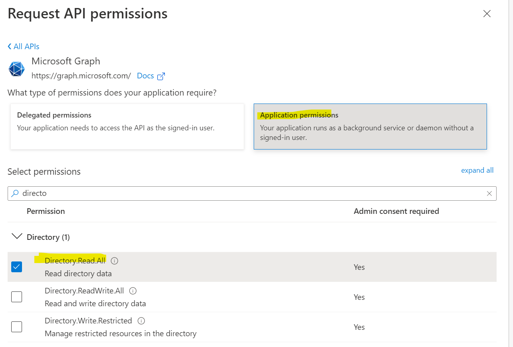
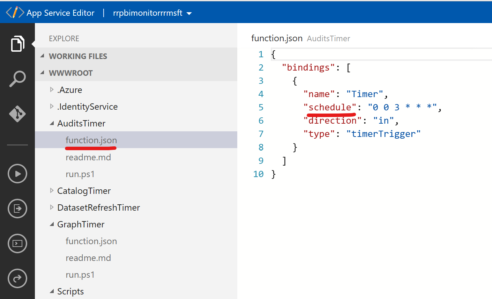
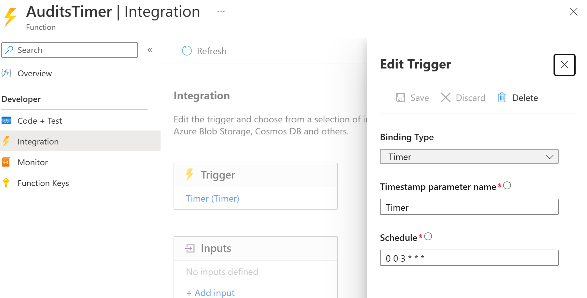
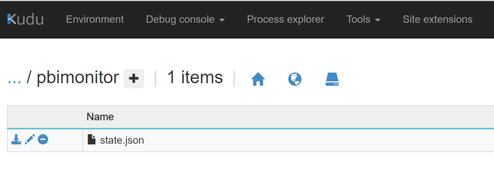
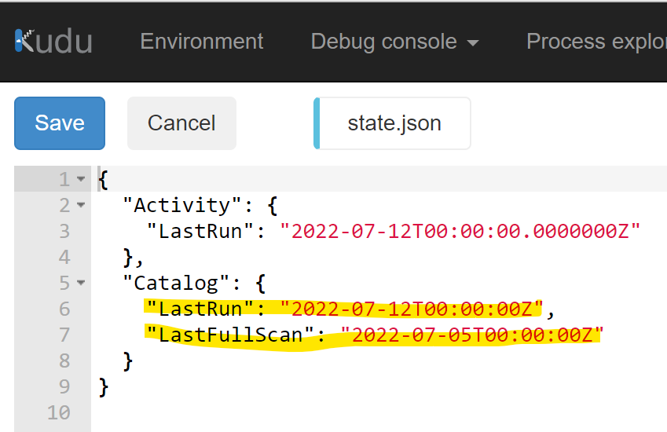
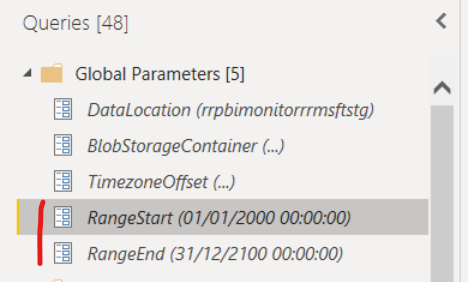
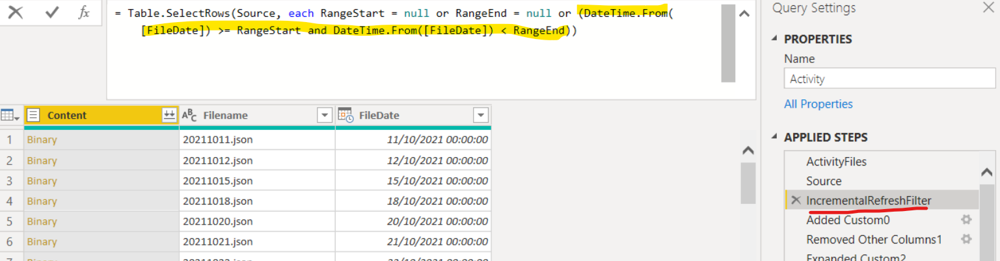
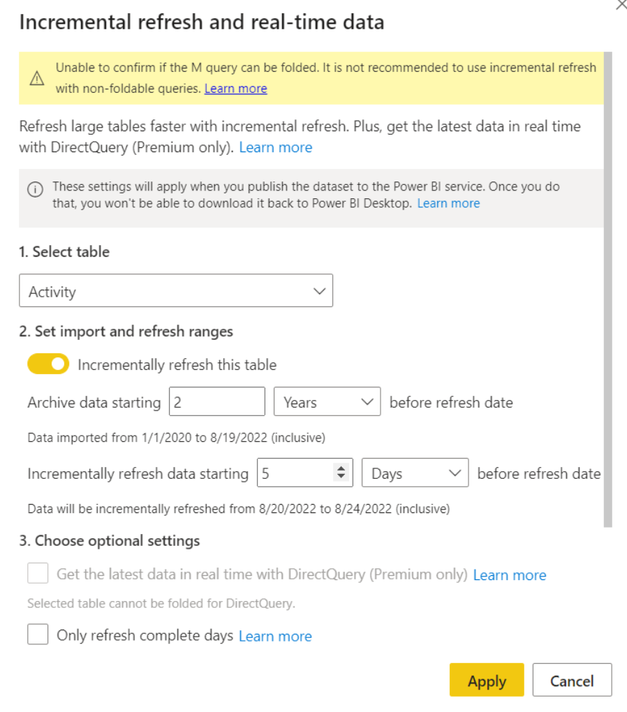

# Intro

For more information please watch the session [PBI Monitoring 101](https://youtu.be/viMLGEbTtog) (slides [here](https://github.com/RuiRomano/sessionslides/blob/main/PBIMonitoring101.pdf))

This project aims to provide a solution to collect activity & catalog data from your Power BI tenant using powershell scripts and a Power BI templates to analyse all this data.

You can deploy the powershell scripts in two ways:
- [As an Azure Function](#setup---as-an-azure-function) - Recommended
- [As a Local PowerShell in Server](#setup---as-a-local-powershell)


# Requirements

## Ensure you have the propper permissions

- A [Power BI Administrator](https://docs.microsoft.com/en-us/power-bi/admin/service-admin-role) account to change the [Tenant Settings](https://docs.microsoft.com/en-us/power-bi/guidance/admin-tenant-settings)
- Permissions to create an [Azure Active Directory Service Principal](https://docs.microsoft.com/en-us/azure/active-directory/develop/howto-create-service-principal-portal) 
- Permissions to create/use an [Azure Active Directory Security Group](https://docs.microsoft.com/en-us/azure/active-directory/fundamentals/active-directory-groups-create-azure-portal)

## Create a Service Principal & Security Group

> [!NOTE]  
> Azure Active Directory is now call Entra ID.

On Azure Active Directory:

1. Go to "App Registrations" select "New App" and leave the default options
2. Generate a new "Client Secret" on "Certificates & secrets" and save the Secret text
3. Save the App Id & Tenant Id on the overview page of the service principal
4. Create a new Security Group on Azure Active Directory and add the Service Principal above as member
5. Optionally add the following API Application level permissions on "Microsoft Graph" API with Administrator grant to get the license & user info data:
    - User.Read.All
    - Directory.Read.All

        
        
        


## Authorize the Service Principal on PowerBI Tenant

As a Power BI Administrator go to the Power BI Tenant Settings and authorize the Security Group on the following tenant settings:

- "Allow service principals to use read-only Power BI admin APIs"
- "Allow service principals to use Power BI APIs"
- "Enhance admin APIs responses with detailed metadata"
- "Enhance admin APIs responses with DAX and mashup expressions"


# API's Used

| Scope      | Resource | API
| ----------- | -------- |  ---------------- |
| Activity      | Power BI Activity Logs | [Admin API - Activity Events](https://docs.microsoft.com/en-us/rest/api/power-bi/admin/getactivityevents)
| Power BI Metadata  | Workspaces,DataSets,Reports,Dashboards,Permissions,Schema & Lineage | [Admin Scan API – GetModifiedWorkspaces](https://docs.microsoft.com/en-us/rest/api/power-bi/admin/workspace-info-get-modified-workspaces); [Admin Scan API – PostWorkspaceInfo](https://docs.microsoft.com/en-us/rest/api/power-bi/admin/workspace-info-post-workspace-info); [Admin Scan API – GetScanStatus (loop)](https://docs.microsoft.com/en-us/rest/api/power-bi/admin/workspace-info-get-scan-status); [Admin Scan API – GetScanResult](https://docs.microsoft.com/en-us/rest/api/power-bi/admin/workspace-info-get-scan-result)
| RefreshHistory      | Dataset Refresh History      | [Admin API - GetGroupsAsAdmin + Expand DataSets](https://docs.microsoft.com/en-us/rest/api/power-bi/admin/groups_getgroupsasadmin); [Dataset API - Get Refresh History](https://docs.microsoft.com/en-us/rest/api/power-bi/datasets/getrefreshhistoryingroup)
| Users & Licenses  | Users & Licenses; Licenses Details      | [Graph API – Users](https://docs.microsoft.com/en-us/graph/api/user-list?view=graph-rest-1.0&tabs=http);[Graph API – SubscribedSKUs](https://docs.microsoft.com/en-us/graph/api/subscribedsku-list?view=graph-rest-1.0&tabs=http)
|Tenant Settings | Current Fabric Tenant Settings | [Fabric REST APIs / Tenants /  Tenants - Get Tenant Settings](https://learn.microsoft.com/en-us/rest/api/fabric/admin/tenants/get-tenant-settings) |

<br>
<br>

# Setup - As an Azure Function


*Fabric  API used for Tenant settings but does not require any other permissions for your Service Principal

On an Azure Subscription create a resource group:


All the resources should be created in the same region as the Power BI Tenant, to see the region of the Power BI tenant go to the About page on powerbi.com:


Inside the Resource Group start a Function App Creation Wizard


Basics
- Runtime - "PowerShell Core"
- Version 7.0


Hosting
- Storage Account - Create a new storage account to hold the data collected from the Azure Function
- Plan Type - Consumption

> [!NOTE]  
> On a large Power BI tenant a dedicated plan might be needed because on consumption the functions have a 10 minute timeout. Learn more about timeouts [here](https://learn.microsoft.com/en-us/azure/azure-functions/functions-scale#timeout) and how to extend the timeout configuration host.json [here](https://learn.microsoft.com/en-us/azure/azure-functions/functions-host-json).


Monitoring
- Create a new AppInsights for logging & monitoring execution


In the end the resource group shall have the following resources:


To deploy the Azure Function code you need to deploy the [AzureFunction.zip](./AzureFunction.zip) package:


Open the Azure Function page, go to "Advanced Tools" and click "Go ➔" This will take you to a page called "Kudu Services"


Go to "Tools" -> "Zip Push Deploy" and drag & drop the file [AzureFunction.zip](./AzureFunction.zip):


<br>


Confirm if the deploy was successful:


## Azure Function Configuration

Go back to the Azure Function page and click on "Configuration", and manually add the following settings:

| Setting      | Value | Description
| ----------- | ----------- |  --------- |
| PBIMONITOR_StorageConnStr      |      | Optional, only if you want to store data in a different storage from the Storage Account (setting 'AzureWebJobsStorage')  
| PBIMONITOR_AppDataPath      | C:\home\data\pbimonitor       | Path to AppData in Azure Function Disk, its where the state file is stored
| PBIMONITOR_ScriptsPath   | C:\home\site\wwwroot\Scripts        | Path to scripts on Azure Function Disk
| PBIMONITOR_ServicePrincipalId      | [YOUR SERVICE PRINCIPAL ID]       |
| PBIMONITOR_ServicePrincipalSecret  | [YOUR SERVICE PRINCIPAL SECRET]        |
| PBIMONITOR_ServicePrincipalTenantId | [YOUR TENANT ID]      |
| PBIMONITOR_ServicePrincipalEnvironment   | Public       | Power BI Cloud Environment
| PBIMONITOR_StorageContainerName | pbimonitor        | Name of the blob storage container
| PBIMONITOR_StorageRootPath   | raw       | Path on the storage container
| PBIMONITOR_FullScanAfterDays   | 30       | Number of Days to repeat a full scan - Optimization to avoid reading too many scanner files on the Power BI Dataset
| PBIMONITOR_CatalogGetModifiedParameters   |        | Optional, default: 'excludePersonalWorkspaces=false&excludeInActiveWorkspaces=true'
| PBIMONITOR_CatalogGetInfoParameters   |        | Optional, default: 'lineage=true&datasourceDetails=true&getArtifactUsers=true&datasetSchema=false&datasetExpressions=false'
| PBIMONITOR_GraphExtractGroups   | false       | Optional, if 'true' it will extract the members of the security groups to expand artifact permissions.


### Enable Azure Azure Key Vault (Optional)

Its possible to store the Service Principal secret in Azure Key Vault, see the [documentation](https://docs.microsoft.com/en-gb/azure/app-service/app-service-key-vault-references?tabs=azure-cli) for more detail: 

Create a system assigned managed identity for your Azure function:


Create your secrets in Azure Key Vault:


Add access policy for you system assigned managed identity created in your Azure function:


Grant "Get" under "Secret Permissions":


Reference your KeyVault on the Application Settings of Azure Function:

| Setting      | Value 
| ----------- | ----------- 
| PBIMONITOR_ServicePrincipalId      | @Microsoft.KeyVault(VaultName=myvault;SecretName=appid)       
| PBIMONITOR_ServicePrincipalSecret  | @Microsoft.KeyVault(VaultName=myvault;SecretName=pbilog)      
| PBIMONITOR_ServicePrincipalTenantId | @Microsoft.KeyVault(VaultName=myvault;SecretName=tenantid)    


## Azure Function Time Triggers

The Azure Function has 4 time trigger functions enabled by default:

| Function      | Default Execution | Description
| ----------- | ----------- |  --------- |
| AuditsTimer      | Everyday at 2AM       | Fetches activity data from the Actitivy API
| CatalogTimer   | Everyday at 1AM    | Fetches metadata from the tenant: workspaces, datasets, reports,data sources
| DatasetRefreshTimer      | Everyday at 5AM  | Fetches the refresh history of all datasets in workspaces where the service principal is a Member
| GraphTimer  | Everyday at 4AM        | Fetches the User & License information from Graph API |
| TenantSettingsTimer| Everyday at 4am | Fetches Tenant Setting data from Fabric API |

The function should be ready to run, go to the function page and open the “AuditsTimer” and Run it:


### Change Azure Function Time Trigger

Its possible to change the time of the trigger by changing the 'function.json' file for each timer using App Service Editor:



Or editing the timer integration:



## Force a Full Scan

On large tenants you may run into memory issues reading all the data from a Power BI Dataset.

The PowerQuery of the PowerBI template was optimized to only read the scan files since the last full scan and the Azure Function setting 'PBIMONITOR_FullScanAfterDays' ensure a full scan will be executed every X days.

Its also possible to force a full scan by editing the State file (C:\home\data\pbimonitor\state.json) using [Kudo](https://docs.microsoft.com/en-us/azure/app-service/resources-kudu)



And remove properties: Catalog.LastRun, Catalog.LastFullScan (if exists)



## Storage Account

If you dont want to use the built-in storage account of the Azure Function its possible to connect the Azure Function to another storage account by setting the connection string of the storage account in the configuration property: 'PBIMONITOR_StorageConnStr'

## Power BI Report Template

Open the Power BI Report template [PBI - Activity Monitor](./PBI%20-%20Activity%20Monitor%20-%20BlobStorage.pbit) and set the parameters:

Change the parameter "DataLocation" and write the blob storage name:


You'll also need to copy the Access key from the Azure Portal:


And then paste it in the "Account key" box in the Azure Blob Storage credentials, which can be found in the Data Source Settings in Power BI Desktop:


## Incremental Refresh

By default the Power BI template will read all the activity files from the storage account, but those files are not updatable and a possible optimization is to enable [Incremental Refresh](https://docs.microsoft.com/en-us/power-bi/connect-data/incremental-refresh-overview) on the Activity Table.

The template is already prepared to support Incremental Refresh and filter only the new files, there is already a RangeStart & RangeEnd parameter:





On the "Activity" table, enable Incremental Refresh with the desired configuration:



The Dataset refresh should be significantly faster in the service after this configuration.

# Setup - As a Local PowerShell


## Install Required PowerShell Modules (as Administrator)
```
Install-Module -Name MicrosoftPowerBIMgmt -RequiredVersion 1.2.1026
```

## Configuration file

Open the [Config File](./Config.json) and write the saved properties from the Service Principal:
- AppId
- AppSecret
- Tenant Id 


## Run 

The file [Fetch - Run](./Fetch%20-%20Run.ps1) is the entry point to call the other scripts.

Ensure [Fetch - Run](./Fetch%20-%20Run.ps1) is targeting the proper configuration file (parameter "configFilePath") and you can also control which scripts are executed on the parameter $scriptsToRun

Run [Fetch - Run](./Fetch%20-%20Run.ps1)

## Open the Power BI Report Template

Open the [Power BI Template file](./PBI%20-%20Activity%20Monitor%20-%20Disk.pbit) and change the parameter "DataLocation" to the data folder.
